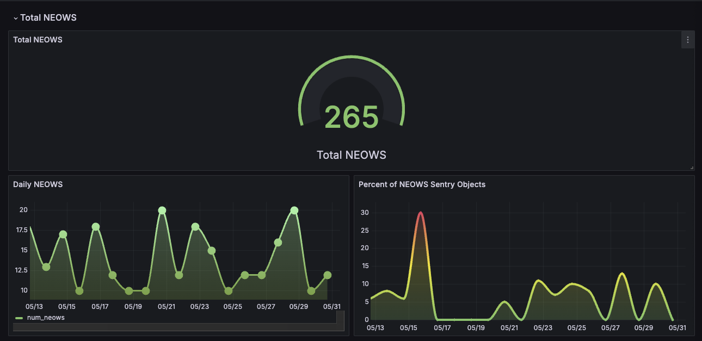
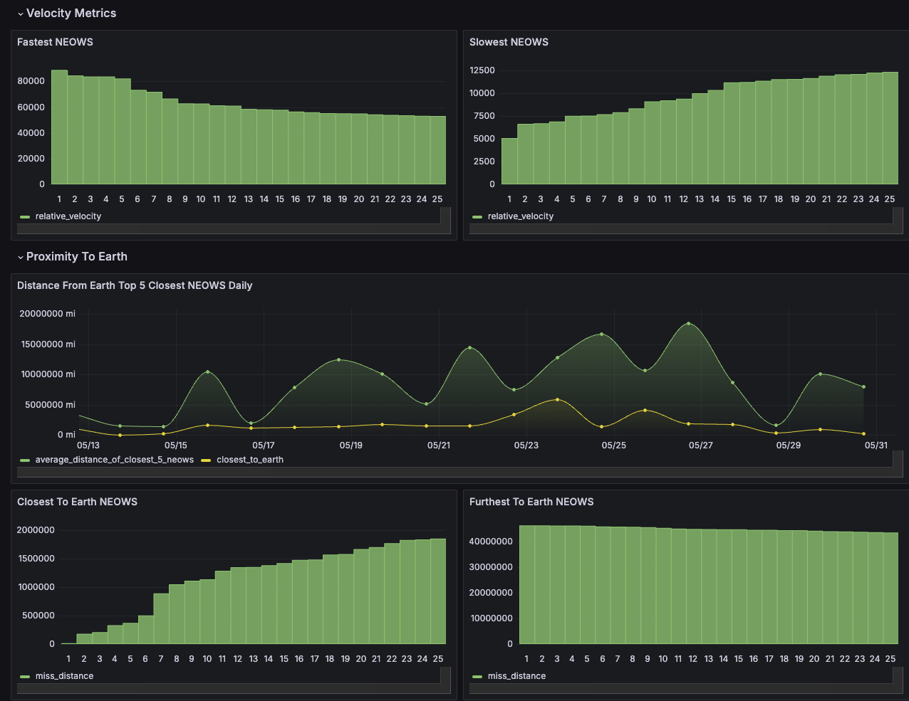
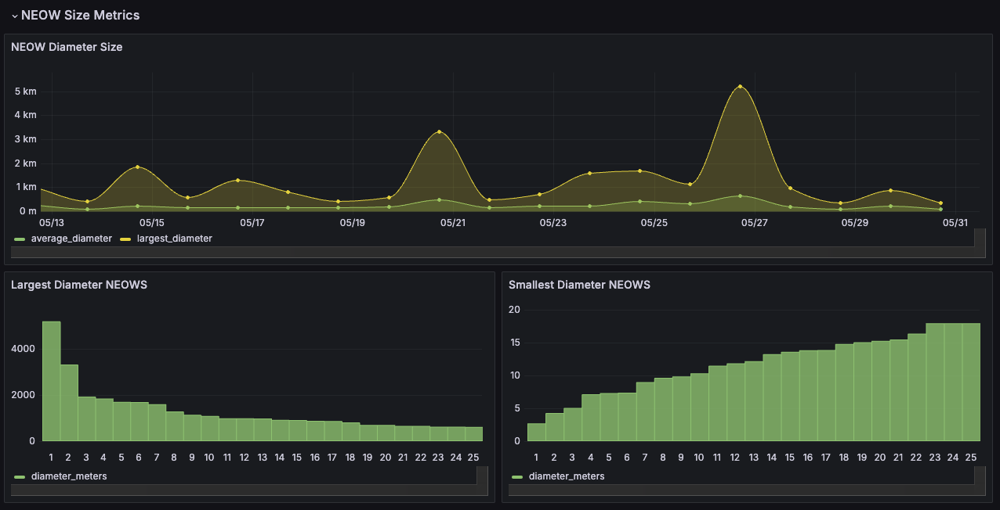

# nasa-neows

# Overview

Nasa Neows uses serverless technology to ingest and analyze near earth object web services to analyze asteroids passing near earth. Utilizing the [NASA API](https://api.nasa.gov/) Asteroids -NeoWs API, along with AWS services this project provides insight into past and future asteroids passing by earth. 

# Features
 - Data Ingestion: Pulling data from the NASA API using AWS Lambda Functions
 - ETL Processing: Transforming the ingested data through an AWS Glue workflow
 - Data Visualization: Querying and visualizing the production dataset using [Grafana](https://grafana.com/)

# Questions I Hoped To Answer
 - What is the volume of asteroids passing nearby earth?
 - Of these what % are SENTRY objects?
 - What is the velocity of the asteroids passing by earth?
 - What is the proximity of the asteroids to earth?
 - How large are the asteroids that are passing by earth?

# Architecture
 1. We are using AWS Lambda to pull data from the NASA API and place the returned data into AWS Firehose
 2. After a certain amount of time Firehose will place the received data into an S3 bucket
 3. An AWS Glue Workflow will initiate and create our production table in AWS Athena
  - A crawler will create a table in Athena from our data in S3 bucket
  - A [delete_neows](https://github.com/jkern-dev/nasa-neows/blob/main/glue_jobs/delete_neows.py) will remove any temporary tables and empty our S3 buckets of historic data that has been used
  - A [create_neow_parquet](https://github.com/jkern-dev/nasa-neows/blob/main/glue_jobs/create_neow_parquet.py) will build a new temporary table with the data created by our crawler, checking that the records being placed do not currently exist in our production table. We also perform additional transformations on the data such as calculating the variance between estimated maximum and minimum diameters of each asteroid. We also rank the asteroids by their size and velocity compared to other asteroids from their approach date.
  - A [neows_dw](https://github.com/jkern-dev/nasa-neows/blob/main/glue_jobs/neows_dq.py) job will run data checks to ensure that the data being received maintains integrity such as that the minimum diameter of an asteroid cannot be less than the maximum diameter of an asteroid
  - A [publish_prod](https://github.com/jkern-dev/nasa-neows/blob/main/glue_jobs/publish_prod.py) will then insert our transformed data from our temporary table and place it into our production table that is used with Grafana
4. Data from our production table is then queried in Grafana and visualizations are built to answer the questions listed above. 

# Data Visualization
Below is a snapshot of our Grafana Dashboard as of 6/2/24

